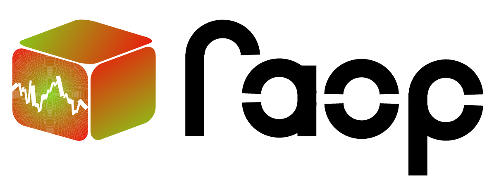

<div align="center">
  
</div>

---

[//]: # ([![PyPI Version]&#40;https://img.shields.io/pypi/v/your-package-name.svg&#41;]&#40;https://pypi.org/project/your-package-name/&#41;)
[](https://opensource.org/licenses/MIT)

[//]: # ([![Python Versions]&#40;https://img.shields.io/pypi/pyversions/your-package-name.svg&#41;]&#40;https://pypi.org/project/your-package-name/&#41;)
[//]: # ([![Coverage]&#40;https://img.shields.io/codecov/c/gh/your-username/your-package-name&#41;]&#40;https://codecov.io/gh/your-username/your-package-name&#41;)
[](https://github.com/your-username/your-package-name)
[](https://github.com/your-username/your-package-name)
[](https://github.com/your-username/your-package-name)

# raop 
__r__(isk)-__a__(ware ) __o__(ption) __p__(ricing) Library

_raop_ is a Python package providing several tools to analyse various types of 
financial options while considering risk factors.


## 🌟 Key Features

* __Option Pricing__ and __Greeks Computation__ through multiple possible approaches
(Black-Scholes model, Binomial tree, Monte-Carlo simulations). Available types of options are:
  * European;
  * American;


Next options to be implemented will be: Asian, Barrier, Look-Back, Binary, Spread, Exchange, Chooser and Quanto.


* __Graph Generation__ to facilitate characterizing an option with sensitivity analyses
on its parameters.


* __Stochastic Processes Simulation__ with different possible processes. Available processes are currently:
  * Geometric Brownian Motion;
  * Arithmetic Brownian Motion;
  * Merton Jump-Diffusion;
  * Ornstein-Uhlenbeck process;
  * Cox-Ingersoll-Ross process;
  * Heston model;
  * Variance-Gamma model.


* Incoming features: 
  * __VaR Computation__
  * __Implied Volatility Computation__


## ⬇️ Installation Instructions

To install the package, you can either use the quick method by using ``pip``, writing the following
command in your terminal:

```bash
pip install raop
```

Or you can clone the GitHub project and, in the root directory of the project (i.e. the one containing the
``setup.py`` file), use ``pip`` to install it. To do so, open a terminal and in the folder where you want
to install the package, run the following commands:

```bash
git clone https://github.com/GFaure9/raop.git
cd raop
pip install --upgrade setuptools  # making sure that an up-to-date version of setuptools is installed
pip install -e .
```

That's it! You can now start using the package 😊!

## 🚀 Usage Examples

Let's see how the package can be used through some examples.

We will first see how to instantiate a European call option and estimate its price with
the Black-Scholes model, with the Binomial model and with Monte-Carlo simulations.

We will then see how we can also compute the greeks of this option.

Finally, we will learn how to plot some graphs to understand how the option's price
and greeks depend on its parameters.

### 1. Creating an ``Option`` object

```py
from raop.options import Option

call_euro = Option()
```

## 📖 Documentation

Detailed package documentation can be found at ???


