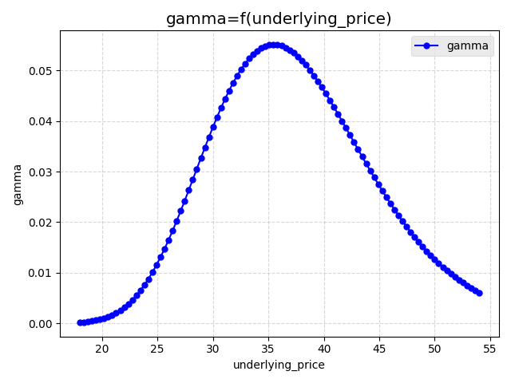
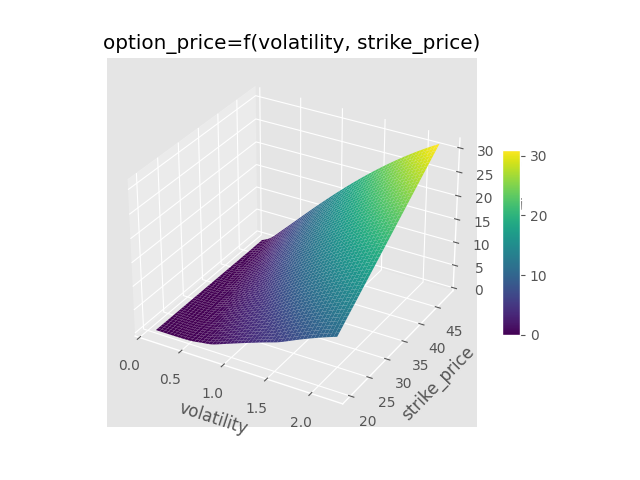

<div align="center">
  
</div>

---

[//]: # ([![PyPI Version]&#40;https://img.shields.io/pypi/v/your-package-name.svg&#41;]&#40;https://pypi.org/project/your-package-name/&#41;)
[](https://opensource.org/licenses/MIT)

[//]: # ([![Python Versions]&#40;https://img.shields.io/pypi/pyversions/your-package-name.svg&#41;]&#40;https://pypi.org/project/your-package-name/&#41;)
[//]: # ([![Coverage]&#40;https://img.shields.io/codecov/c/gh/your-username/your-package-name&#41;]&#40;https://codecov.io/gh/your-username/your-package-name&#41;)
[](https://github.com/your-username/your-package-name)
[](https://github.com/your-username/your-package-name)
[](https://github.com/your-username/your-package-name)


[//]: # (<div class="warning" style="background-color: #FFE8B2; border-left: 6px solid #FFC857; padding: 10px; margin-bottom: 20px; font-size: 16px;">)

[//]: # (  <p>⚠ WARNING ⚠ This package is in alpha stage of development. Use at your own risk.</p>)

[//]: # (</div>)

[//]: # (> ⚠ __WARNING__  )

[//]: # (> __This package is in alpha stage of development. Use at your own risk__.)

> [!WARNING]
> __This package is in alpha stage of development. Use at your own risk.__


# raop 
__r__(isk)-__a__(ware ) __o__(ption) __p__(ricing) Library

_raop_ is a Python package providing several tools to analyse various types of 
financial options while considering risk factors.

---

# Table of Contents 

1. [Key Features](#feats)
2. [Installation Instructions](#install)
3. [Usage Examples](#usage)
4. [Documentation](#documentation)

---

## 🌟 Key Features <a id="feats"></a>

* __Option Pricing__ and __Greeks Computation__ through multiple possible approaches
(Black-Scholes model, Binomial tree, Monte-Carlo simulations). Available types of options are:
  * European;
  * American;


Next options to be implemented will be: Asian, Barrier, Look-Back, Binary, Spread, Exchange, Chooser and Quanto.


* __Graph Generation__ to facilitate characterizing an option with sensitivity analyses
on its parameters.


* __Stochastic Processes Simulation__ with different possible processes. Available processes are currently:
  * Geometric Brownian Motion;
  * Arithmetic Brownian Motion;
  * Merton Jump-Diffusion;
  * Ornstein-Uhlenbeck process;
  * Cox-Ingersoll-Ross process;
  * Heston model;
  * Variance-Gamma model.


* Incoming features: 
  * __VaR Computation__
  * __Implied Volatility Computation__


## ⬇️ Installation Instructions <a id="install"></a>

To install the package, you can either use the quick method by using ``pip``, writing the following
command in your terminal:

```bash
pip install raop
```

Or you can clone the GitHub project and, in the root directory of the project (i.e. the one containing the
``setup.py`` file), use ``pip`` to install it. To do so, open a terminal and in the folder where you want
to install the package, run the following commands:

```bash
git clone https://github.com/GFaure9/raop.git
cd raop
pip install --upgrade setuptools  # making sure that an up-to-date version of setuptools is installed
pip install -e .
```

That's it! You can now start using the package 😊!

## 🚀 Usage Examples <a id="usage"></a>

Let's see how the package can be used through some examples.

We will first see how to instantiate a European call option and estimate its price with
the Black-Scholes model, with the Binomial model and with Monte-Carlo simulations.\
We will then see how we can also compute the greeks of this option.\
Finally, we will learn how to plot some graphs to understand how the option's price
and greeks depend on its parameters.

The following scripts are consolidated in [base_example.py](examples/base_example.py).

### 1. Creating an ``Option`` object

To define the option, we must provide its different parameters to the instance
of the ``Option`` class that will be created.

```py
from raop.options import Option

call_euro = Option(
  name="european",
  option_type="call",
  underlying_price=36,
  strike_price=40,
  time_to_maturity=1,
  risk_free_rate=0.06,
  volatility=0.2
)

print("The Option instance 'call_euro' has the following attributes:\n", call_euro.to_dict())
```

The script above will return the following result:

```
The Option instance 'call_euro' has the following attributes:
 {'name': 'european', 'option_type': 'call', 's': 36, 'k': 40, 'r': 0.06, 'time_to_maturity': 1, 'sigma': 0.2}
```

### 2. Option's price computation

To determine the valuation of the generated option, utilize the ``compute_price`` method while 
specifying the desired pricing model as an argument. Distinct pricing models can be imported from
the ``raop.pricing_models`` module. It may be needed to provide additional arguments depending on the
chosen pricing model (refer to the [Documentation](#documentation) for specific mandatory arguments).

[//]: # (> 🛈 The pricing model may have to be chosen according to the option. Some models are not suitable for certain)

[//]: # (> types of options. In that case, an error message will be displayed. )

> [!NOTE]
> The pricing model may have to be chosen according to the option. Some models are not suitable for certain
> types of options: in that case, an error message will be displayed. 

#### a. With ``BlackScholes`` model

For instance, you can use the Black–Scholes–Merton model as follows:

```py
from raop.pricing_models import BlackScholes

bs_price = call_euro.compute_price(BlackScholes)

print(f"'call_euro' price estimated by Black-Scholes method is: {bs_price}")
```

The script above will return the following result:

```
'call_euro' price estimated by Black-Scholes method is: 2.1737264482268905
```

#### b. With ``Binomial`` model

You can also employ the Cox-Ross-Rubinstein Binomial model to calculate option price. 
Simply choose the corresponding model and specify the number of layers for the generated binomial tree as follows:

```py
from raop.pricing_models import Binomial

bino_price = call_euro.compute_price(Binomial, n_layers=20)

print(f"'call_euro' price estimated by Binomial method is: {bino_price}")
```

The script above will return the following result:

```
'call_euro' price estimated by Binomial method is: 2.168536860102567
```

#### c. With ``MonteCarlo`` model

To use the Monte-Carlo method for option price computation, you will need first to define a stochastic process
to model the evolution of the underlying asset's price over time. Different processes are already implemented in
``raop.stochastic_processes``.

<div align="center">
  
</div>

In the following example, we instantiate a Geometric Brownian Motion
``"gbm"`` (see the [Documentation](#documentation) of the ``StochasticProcess`` class to access 
the available models and their abbreviations). It is also necessary to enter the desired 
number of simulated  processes as well as the number of time steps for the processes' discretization
(the time step will be $\Delta t = \frac{T}{n_t}$ with $T$ the time to maturity).

```py
from raop.stochastic_processes import StochasticProcess
from raop.pricing_models import MonteCarlo


gbm = StochasticProcess(x0=call_euro.s, model_name="gbm", mu=call_euro.r, sigma=call_euro.sigma)

mc_price = call_euro.compute_price(MonteCarlo, stochastic_process=gbm, n_processes=10000, n_t=50)

print(f"'call_euro' price estimated by Monte-Carlo method is: {mc_price}")
```

The script above returned the following result (note that, as long as the Monte-Carlo method is stochastic,
this result can vary from an evaluation to another and depending on chosen the number of simulations):

```
'call_euro' price estimated by Monte-Carlo method is: 2.176008642538358
```

### 3. Option's greeks computation

Similarly, you can calculate the option's greeks using the ``compute_greeks`` method.
The computation models available here are identical to those used for price calculations.
The following code shows an example of implementation for the same option as before:

```py
from raop.pricing_models import BlackScholes

bs_greeks = call_euro.compute_greeks(BlackScholes)

print(f"'call_euro' greeks estimated by Black-Scholes method are:\n{bs_greeks}")
```

The script above will return the following result:

```
'call_euro' greeks estimated by Black-Scholes method are:
{'delta': 0.4495483275166151, 'gamma': 0.05496498097080381, 'vega': 14.246923067632347, 'theta': -2.26529310730551, 'rho': 14.01001334237125}
```

### 4. Sensitivity analyses: plotting graphs

The package also facilitates sensitivity analyses of option parameters on valuation
outputs and enables the creation of graphs based on these analyses.

```py
from raop.pricing_models import BlackScholes, Binomial
from raop.graphs import Graph

# Sensitivity analyses of Gamma VS Underlying Price
df_curve = call_euro.sensitivity(
    output="gamma",
    variable="underlying_price",
    variations=(-50, 50),  # +/- 50% variations of option's underlying price 
    num=100,
    model=BlackScholes,  # using Black-Scholes model
)

# Plot from the computed data
graph_curve = Graph(df_curve)
graph_curve.plot_curve()

# Sensitivity analyses of Option's Price VS Volatilty and Strike Price
df_surf = call_euro.sensitivity(
    output="option_price",
    variable=["volatility", "strike_price"],
    variations=[(-50, 1000), (-50, 20)],
    num=20,
    model=Binomial,  # using Binomial model with 10 layers
    n_layers=10,
)

# Creating a plot from the computed data
graph_surf = Graph(df_surf)
graph_surf.plot_surface()
```

The following graphs will be plotted:

<div style="display: flex; justify-content: center; gap: 20px;">
  
  
</div>

It's worth noting that you can also directly access the sensitivity study values
using the generated pd.DataFrame, as shown below:

```py
print(f"Option's Price VS Volatilty and Strike Price pd.DataFrame:\n{df_surf}")
```
```
Option's Price VS Volatilty and Strike Price pd.DataFrame:
     volatility  strike_price  option_price
0           0.1     20.000000      0.000000
1           0.1     21.473684      0.000000
2           0.1     22.947368      0.000000
3           0.1     24.421053      0.000000
4           0.1     25.894737      0.000000
..          ...           ...           ...
395         2.2     42.105263     27.032943
396         2.2     43.578947     28.115194
397         2.2     45.052632     29.197446
398         2.2     46.526316     30.279697
399         2.2     48.000000     31.361948

[400 rows x 3 columns]
```

## 📖 Documentation <a id="documentation"></a>

Detailed package documentation can be found at ???

[//]: # (https://github.com/banesullivan/README/blob/main/README.md?plain=1)


